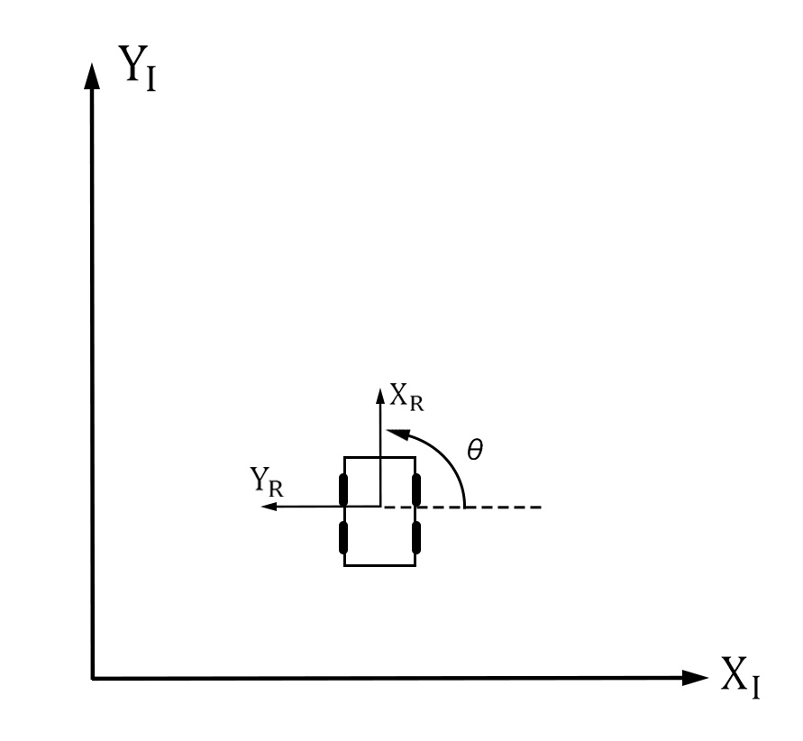
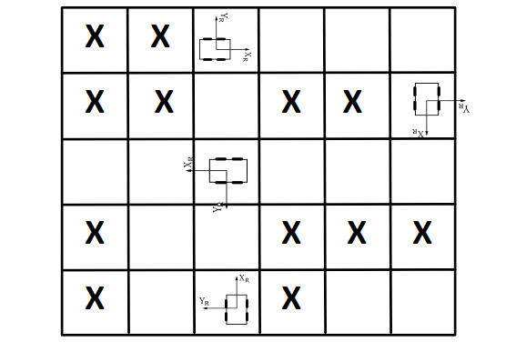

## A* Algorithm

#### 车坐标模型

 

   

   
 

   当前模型旋转角度θ=π/2<

#### 网格中车模型方向  

 

#### 运动方向表格
|   θ    | Up    | Down   | Left  | Right |  
| :-----:|:-----:| :-----:|:-----:|:-----:|
|   π/2  |(-1,0) | (1,0)  | (0,-1)| (0,1) |
|   π    |(0,-1) | (0,1)  | (1,0) | (-1,0)|
|   0    | (0,1) | (0,-1) | (-1,0)| (1,0) |
|   -π/2 |(1,0)  | (-1,0) | (0,1) | (0,-1)|

#### 运动转化表格  
| Up    | Down   | Left  | Right |  
|:-----:| :-----:|:-----:|:-----:|
|(-sinθ,cosθ) | (sinθ,-cosθ)  | (-cosθ,-sinθ)| (cosθ,sinθ) |
